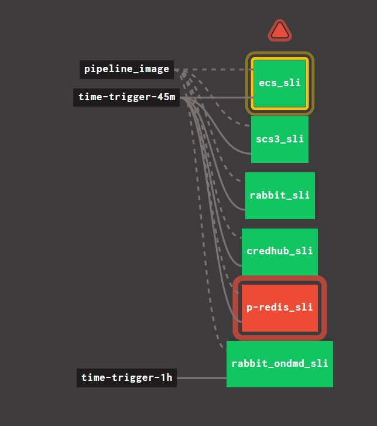
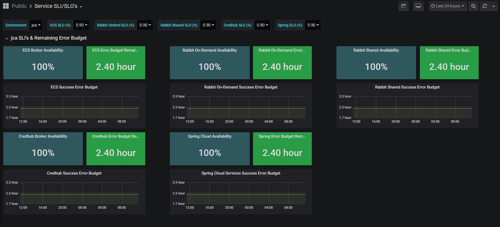

# pcf-sre
Pipeline, application, and dashboard for Site reliability engineering (SRE)

# Pre-req
- Concourse
- Prometheus/Grafana
- Configure and deploy the metrics collector application
  - https://github.com/theautoroboto/metrics_collector.git
- build docker image from Dockerfile

# Results
## Metric application results
```
# HELP credhub_svc_creation_availability Credhub SLI gauge use to collect Credhub SLIs
# TYPE credhub_svc_creation_availability gauge
credhub_svc_creation_availability 1
# HELP docker_metric_success Docker SLI gauge use to collect Docker SLIs
# TYPE docker_metric_success gauge
docker_metric_success 0
# HELP ecs_metric_success ECS SLI gauge use to collect ECS SLIs
# TYPE ecs_metric_success gauge
ecs_metric_success 1
```
## Pipeline


## Dashboard
